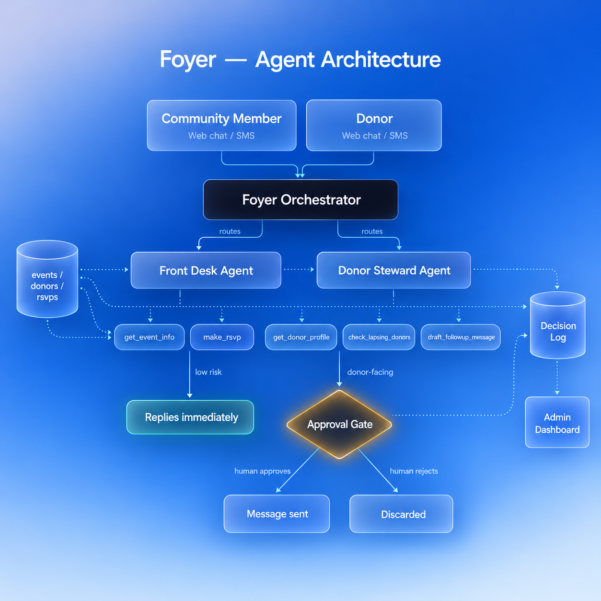

# Foyer

**An AI agent for small nonprofits that have no dedicated coordinator.**

Built with the [Strands Agents SDK](https://strandsagents.com) for the AWS
*Agents for Humans* Hackathon — **Good Neighbor Agents** track.

---

## The problem

Small nonprofits run on volunteers. Nobody is paid to answer "when's the food
drive?" for the fortieth time, and nobody has time to notice that a reliable
donor quietly stopped giving four months ago. Both jobs are repetitive,
both are relationship work, and both get dropped.

The obvious fix — hand it to an AI agent — runs into a second problem. AWS's own
Public Sector research on
[nonprofit agentic AI governance](https://aws.amazon.com/blogs/publicsector/a-governance-framework-for-nonprofit-agentic-ai-on-aws/)
names why nonprofits hesitate: agents that run under uncontrolled accounts,
agents whose decisions can't be explained, and no way to demonstrate to a board
that sensitive data was handled properly.

So an agent that just *acts* isn't adoptable. It has to be accountable.

## What Foyer does

**Front Desk** — answers community questions (event dates, location, parking,
spots remaining) and handles RSVPs including capacity limits. These are
low-risk, reversible actions, so it acts autonomously.

**Donor Steward** — tracks giving history, detects donors lapsing against their
own giving cadence, and drafts personalized re-engagement and thank-you
messages. It has no ability to send anything.

**The Approval Gate** — every donor-facing action is queued for a human, with a
plain-language reason attached. The boundary isn't a rule the model is asked to
remember; the Donor Steward simply has no "send" tool. No prompt can talk it
into acting alone.

**The Decision Log** — every action, by agent or human, lands in one continuous
audit trail written in language a board member can read without a technical
briefing.

## Architecture



A top-level orchestrator routes each inbound message to the right specialist
using the *agents-as-tools* pattern. Both sub-agents share the governance layer.

## Project structure

```
orchestrator.py         Routes messages to the right sub-agent
config.py               Pinned Bedrock model ID (single source of truth)
main.py                 CLI entry point
server.py               FastAPI server for both web surfaces
agentcore_app.py        Bedrock AgentCore Runtime entry point

agents/
  front_desk.py         Event info + RSVPs (autonomous, low-risk)
  donor_steward.py      Donor tracking + drafting (gated by approval)

tools/
  store.py              JSON read/write helpers
  front_desk_tools.py   get_event_info, make_rsvp
  donor_tools.py        get_donor_profile, check_lapsing_donors,
                        draft_followup_message

governance/
  tools.py              log_decision, queue_approval (agent-callable)
  queue.py              Approve/reject operations (human-only, NOT tools)

web/
  index.html            Community chat surface
  admin.html            Approval queue + decision log
data/                   Mock dataset: events, donors, rsvps, logs
docs/                   Architecture diagram
```

**A note on `governance/queue.py`:** approve and reject are deliberately plain
Python functions rather than `@tool`-decorated ones. Keeping them out of the
tool registry is what makes the boundary structural instead of advisory.

## Running locally

**Prerequisites:** Python 3.10+, an AWS account with Amazon Bedrock model access
enabled in your region.

```bash
python3 -m venv .venv
source .venv/bin/activate
pip install -r requirements.txt
aws configure          # access key, secret, region (us-east-1), json
```

Set the model your account has access to in `config.py`. To list what's
available to you:

```bash
aws bedrock list-inference-profiles --region us-east-1 \
  --query "inferenceProfileSummaries[?contains(inferenceProfileId,'claude')].inferenceProfileId" \
  --output table
```

**CLI:**
```bash
python main.py
```

**Web (both surfaces):**
```bash
uvicorn server:app --reload
```
- Community chat → http://localhost:8000
- Admin approval queue → http://localhost:8000/admin.html

### Offline UI mode

`FOYER_DEMO_MODE=1` serves canned responses so the interface can be developed
without Bedrock access. Useful for frontend work; not for evaluating the agent.

```bash
FOYER_DEMO_MODE=1 uvicorn server:app --reload
```

## Deploying to Amazon Bedrock AgentCore

```bash
pip install "bedrock-agentcore-starter-toolkit>=0.1.21"
agentcore configure -e agentcore_app.py
agentcore launch
```

Press Enter at the execution-role prompt to auto-create a role with the required
Runtime, Memory and Observability permissions.

## Try it

```
When is the food drive and where do I park?
Can you sign up Ada Obi for the food drive? ada@example.com
Are any donors lapsing?
Draft a re-engagement message for James Okafor
```

The last one won't send. It lands in the approval queue with its reasoning —
open `/admin.html` to approve or reject it.

## License

MIT — see [LICENSE](LICENSE).
